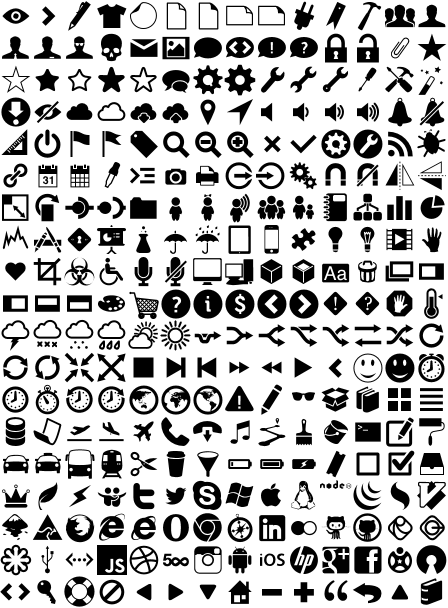

# RaphaelIcons

## statement

Translation of the Raphael icon suite by Dmitry Baranovskiy into a Java2D-based Scala library. Icon source made available from [raphaeljs.com/icons](http://raphaeljs.com/icons) under the [MIT License](http://raphaeljs.com/license.html). Library code (C)opyright 2013&ndash;2019 by Hanns Holger Rutz. All rights reserved. Released under the GNU LGPL v2.1+.

## overview

## linking

Use the following dependency:

    "de.sciss" %% "raphael-icons" % v

The current version `v` is `"1.0.6"`.

## building

Uses Scala 2.12, 2.11 and sbt for building. The actual icon class is synthesised into sub-project `core`, using the source generator provided in sub-project `generate`.

To see the source generation, run `sbt generate/run`. To compile the core project, use `sbt raphael-icons/compile`. To run a demo, use `sbt raphael-icons/test:run`. There are two demos. `Demo` shows a matrix of all icons. Mouse mouse hover to see the icon names (method names in `Shapes.java`). `IconDemo` shows how to create a custom sized icon.

## contributing

Please see the file [CONTRIBUTING.md](CONTRIBUTING.md)

## reminder to self

- to publish, `sbt +raphael-icons/publishSigned`.
- to try out path generation, `sbt generate/console` and then `path(<someString>)`.
